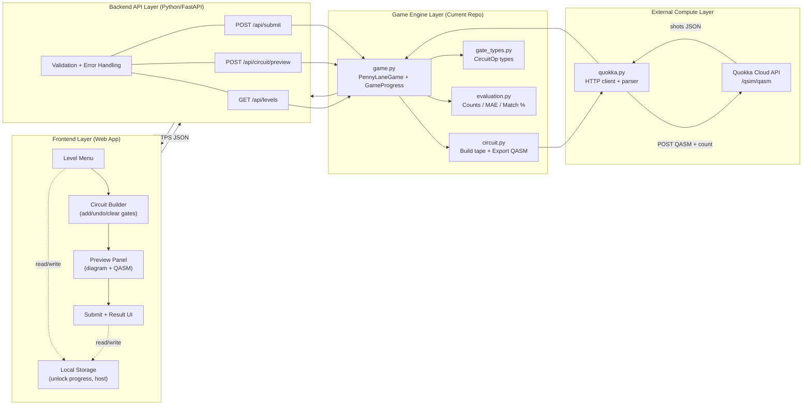
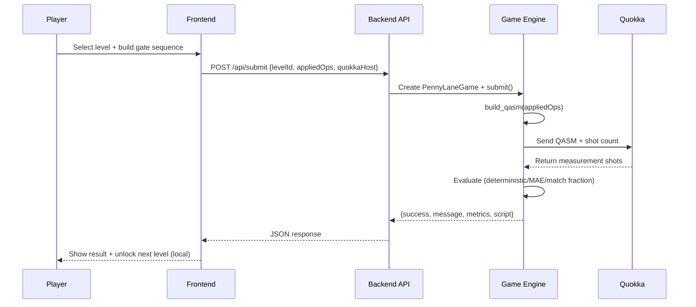

# System Architecture (Frontend + Backend + Quokka)

This project’s runtime pipeline has four layers:

- **Frontend**: UI for levels, circuit building, preview, submit, results (no login)
- **Backend API**: validates input, calls game engine, calls Quokka, returns JSON
- **Game Engine (this repo)**: builds circuits/QASM and evaluates results
- **Quokka**: external simulator that executes OpenQASM and returns shot results

## Layered Diagram

## Submit Flow (Sequence)

